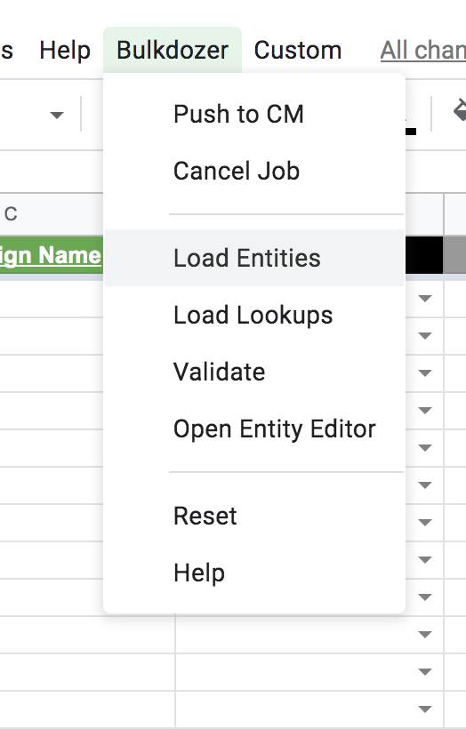

# Campaign QA and Verification

## Introduction 

In this section we will review how to use the Bulkdozer feed to review
an existing campaign and ensure all expected configurations are correct.
We will also look into custom tools based on Bulkdozer can be used to
verify placement / ad / creative relationships, and event tag
assignments. 

## Before you Begin 

You will need a Bulkdozer feed, if you don't have one please refer to
the Feed Setup page. You will also need an existing campaign to 
validate. We suggest that you do not use Bulkdozer to modify live
campaigns before you have familiarized yourself with the tool, so either
use an old campaign that is no longer live, or create your own. If you
want to create a test campaign with Bulkdozer you can do so by following
the Getting Started guide.

## Reset your feed

Since we are going to start working on a new campaign, it is always a 
good idea to reset your feed. You can do that through the menu Bulkdozer
-> Reset. Resetting may take up to a minute, wait for the "Running
script" message to disappear before moving to the next step.

## Identify items to load 

We will use the Bulkdozer "Load Entities" functionality to load the
existing campaign. You can identify the items you'd like to load by
putting an existing ID in the respective column of your feed. In this
particular case we want to load an entire campaign, and therefore we
will put the campaign ID in the "Campaign ID" field of the Campaign tab:

## Load Entities 

Now that the items we'd like to load have been identified, click the
menu Bulkdozer -> Load Entities. 

Click yes in the confirmation popup, and notice how Bulkdozer moves to
the "Log" tab of the feed, there you can visualize the progress. 

Once you see a final message saying: "Campaign manager data load
complete" the process is done. 

Now you can browse the Bulkdozer tabs and see your campaign manager
data.

## Advanced Campaign QA 

By using Google Sheets features such as lookups, queries, and custom 
scripts, your engineering team or the Google Bulkdozer team can create
custom solutions that can help you verify specific aspects of your
campaign. here are some examples: 

- Custom sheet can be created to show side by side in a single tab
campaigns, placement groups, placements, ads, creatives, and landing
pages, showing how they are associated with each other. This can be used
as a one stop shop to verify the structure of your campaign. 

- Event tag assignment. A tab can be created that shows each ad and the
list of event tags that are applied and excluded, explicitly or 
implicitly to each ad. That way you can verify what event tags will
actually fire when an ad serves.

  
---
&copy; 2019 Google Inc. - Apache License, Version 2.0

By using Bulkdozer the user agrees with the [Terms & Conditions](tutorials/Bulkdozer/Terms_and_Conditions.md).
